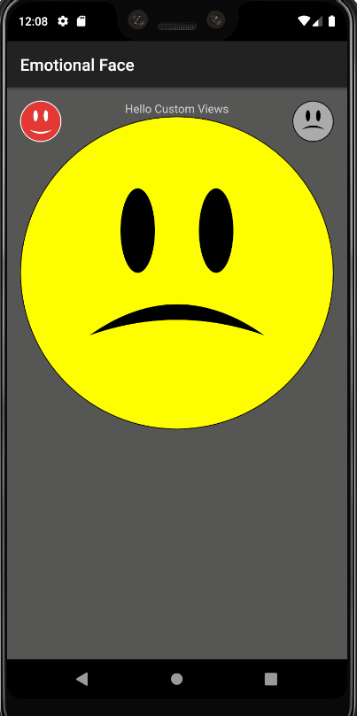

## [Android Custom View Tutorial](https://www.raywenderlich.com/142-android-custom-view-tutorial)

Create an Android Custom View in Kotlin and learn how to :
 - draw shapes on the canvas
 - make views responsive
 - create new XML attributes
 - reuse the custom view for different use cases

## Screenshots

